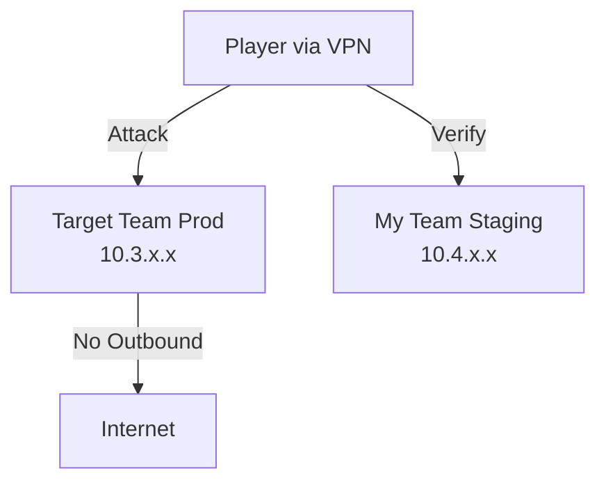
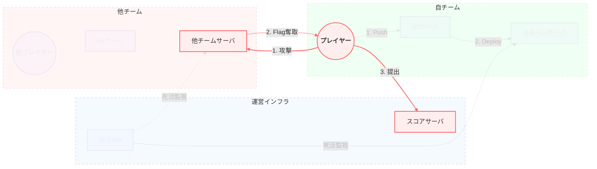
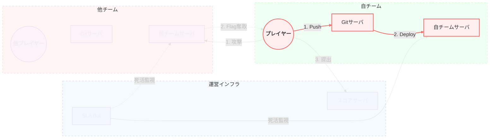
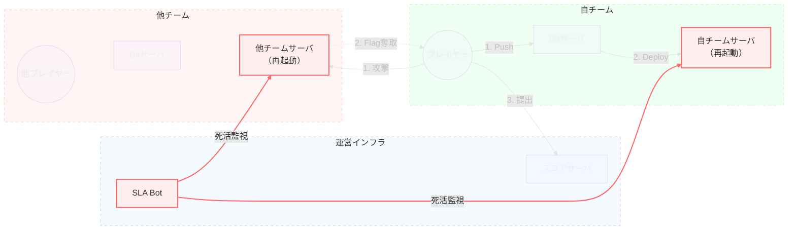

# Web Application Attack & Defense

<div class="text-2xl font-bold opacity-80">
  Attack & Defense形式のCTFでリアルタイムの攻防戦を体験してみよう
</div>

<div class="mt-4 text-sm opacity-60">
  セキュリティ・キャンプ2026ミニ（大阪開催）
</div>

<div class="abs-br m-6 flex gap-2">
  <a href="https://github.com/tyage/minicamp-osaka2026-ad" target="_blank" alt="GitHub" title="Open in GitHub"
    class="text-xl icon-btn opacity-50 !border-none !hover:text-white">
    <carbon-logo-github />
  </a>
</div>

---
layout: intro
---

# 自己紹介

<div class="grid grid-cols-[1fr_200px] gap-8 items-start mt-8">

<div>

## 山崎 啓太郎 (@tyage)

<div class="opacity-90 text-base leading-relaxed">

- **経歴**
  - 2010年 セキュリティ&プログラミングキャンプ卒業
  - 2018年～ LINE株式会社
  - 2020年～ GMOサイバーセキュリティ byイエラエ株式会社
- **CTF**
  - **Player**: DEF CON CTF, Google CTF Finals 出場, SECCON CTF 13 Finals 優勝等
  - **Organizer**: ICC Tokyo 2025, CODE BLUE CTF等
- **講師歴**
  - セキュリティ・キャンプ全国大会 2022・2023 講師
- **著書**
  - 「実践 Webペネトレーションテスト」

</div>
</div>

<div class="flex flex-col items-center gap-2">
  
</div>

</div>

---
layout: center
class: text-center
---

# Q. CTFに参加したことある人✋️

---
layout: center
class: text-center
---

# Q. A&D形式のCTFに参加したことある人✋️

---

# CTF (Capture The Flag) とは？

情報セキュリティ技術を競う競技

- **目的**: 隠された「Flag（旗）」を見つけ出すこと
- **主な形式**:
  - **Jeopardy（ジョパディ）形式**:
    - Web, Crypto, Pwn, Reversing... などカテゴリ別の問題を解く
    - 最も一般的
  - **Attack & Defense (A&D) 形式**:
    - チームごとに守るべきサーバー/サービスがある
    - 自チームを守りつつ、他チームを攻撃する
    - **<span class="text-orange-400">今回の演習はこの形式！</span>**

---

# 世界の代表的な A&D CTF

ICC以外にも、世界中でAttack & Defense形式のCTFが開催されています。

<div class="grid grid-cols-2 gap-8 mt-8">

<div class="bg-black/5 dark:bg-white/5 p-6 rounded-xl border border-gray-200 dark:border-gray-700">

### DEF CON CTF

- 世界最高峰のハッキング大会
- ラスベガスで毎年開催される決勝戦は伝統的にA&D形式
- 独自アーキテクチャや未知の脆弱性が飛び交う

</div>

<div class="bg-black/5 dark:bg-white/5 p-6 rounded-xl border border-gray-200 dark:border-gray-700">

### HITCON CTF

- 台湾で開催されるCTF
- A&Dのクオリティが非常に高く、世界中のトップチームが参加
- Web, Pwn, Cryptoなどバランスの良い出題

</div>

</div>

---

# ICC (International Cybersecurity Challenge) とは？

<div class="grid grid-cols-[1.3fr_1fr] gap-8 mt-8 items-center">

<div>

### 25歳以下の若手実力者が集う世界大会

各地域（欧州、アジア、米国など）の予選を勝ち抜いた代表チームによる対抗戦。

<div class="mt-8 p-4 bg-gray-50 dark:bg-gray-800/50 rounded-lg border border-gray-200 dark:border-gray-700">

<div class="font-bold mb-2 flex items-center gap-2 text-lg">
  <span>🇯🇵</span>
  <span>2025年、その世界大会が日本に上陸</span>
</div>

**ICC Tokyo** として、内閣サイバーセキュリティセンター (NISC) 主催のもと幕張で開催されました。

- **競技形式**: <span class="text-blue-500 font-bold">Jeopardy</span> と <span class="text-red-500 font-bold">Attack & Defense</span> の2種目
- **参加**: アジア・オセアニアを含む世界8地域の選抜チーム

</div>

</div>

<div class="grid grid-cols-2 gap-2 h-full">
  <div class="bg-gray-200 dark:bg-gray-700 rounded-lg aspect-video flex items-center justify-center text-xs text-gray-500">Competition Area</div>
  <div class="bg-gray-200 dark:bg-gray-700 rounded-lg aspect-video flex items-center justify-center text-xs text-gray-500">Team Asia</div>
  <div class="bg-gray-200 dark:bg-gray-700 rounded-lg aspect-video flex items-center justify-center text-xs text-gray-500">Ceremony</div>
  <div class="bg-gray-200 dark:bg-gray-700 rounded-lg aspect-video flex items-center justify-center text-xs text-gray-500">Networking</div>
</div>

</div>

---
layout: center
class: text-center
---

# A&Dのゲーム設計について（ICC版）

---

# ICCにおける Attack & Defense

<div class="grid grid-cols-2 gap-12 mt-8 items-center">

<div>

### <span class="text-red-500">Attack</span> & <span class="text-blue-500">Defense</span>

- 全チームに同じ「脆弱なサーバ環境」が配布され、自サーバを運用（防御）しつつ他チームを攻撃し合う
- 5分に1回のサイクルで進行
  - 5分ごとにサーバ再起動、新FLAGの配置、最新パッチの適用が行われる
- 勝負のカギ
  - ⚔️ 攻撃: 脆弱性を見つけて攻略する
  - 🛡️ 防御: 攻撃される前に素早く脆弱性を修正する
</div>

<div class="bg-gray-50 dark:bg-gray-800 p-8 rounded-xl border border-gray-100 dark:border-gray-700 flex items-center justify-center">
  写真 & スコアボード
</div>

</div>

---

# 競技環境のアーキテクチャ

<div class="grid grid-cols-2 gap-8 mt-8 items-start">

<div>

### ネットワーク構成

- **VPN接続**: 配布されたWireGuard設定で接続
- **帯域制限**: 各チーム 100Mbps
- **セグメント分離**:
  - `10.3.x.x`: **本番環境 (Production)**
    - 他チームから攻撃される
    - Flagが存在する
  - `10.4.x.x`: **検証環境 (Staging)**
    - 自チームのみアクセス可能
    - パッチの動作確認用（Flagはダミー）

</div>

<div class="bg-gray-50 dark:bg-gray-800 p-4 rounded-lg border border-gray-200 dark:border-gray-700 text-sm">



</div>

</div>

---

# ゲームの進行

競技は **Tick（ラウンド）** 単位で進行します。


- **一定時間ごとに 1 Tick 進行**
- **各Tickで**
  - 全サーバが自動的に再起動される
  - 新しいFlagが生成される
  - パッチが適用された最新のDockerイメージがデプロイされる
  - プレイヤーは他のチームに攻撃をする
- これを繰り返す

---

# スコアリング詳細

**Total Score = Initial Score + SLA + Defense + Attack**

<div class="grid grid-cols-3 gap-4 mt-8">

<div class="p-4 border rounded-lg border-blue-200 bg-blue-50 dark:bg-blue-900/20 dark:border-blue-800">
  <h3 class="text-blue-600 dark:text-blue-400 font-bold mb-2">🟢 SLA (Availability)</h3>
  <div class="text-sm">
    サービスが正常に稼働しているか？
    <br><br>
    Botが正常性をチェック。<br>
    <strong>Downすると減点。</strong><br>
    パッチで機能を壊さないように注意！
  </div>
</div>

<div class="p-4 border rounded-lg border-green-200 bg-green-50 dark:bg-green-900/20 dark:border-green-800">
  <h3 class="text-green-600 dark:text-green-400 font-bold mb-2">🛡️ Defense</h3>
  <div class="text-sm">
    Flagを守り切れたか？
    <br><br>
    そのTickで、誰にもFlagを盗まれなければ防御成功。<br>
    <strong>1チームでも盗まれると0点。</strong>
  </div>
</div>

<div class="p-4 border rounded-lg border-red-200 bg-red-50 dark:bg-red-900/20 dark:border-red-800">
  <h3 class="text-red-600 dark:text-red-400 font-bold mb-2">⚔️ Attack</h3>
  <div class="text-sm">
    他チームからFlagを奪ったか？
    <br><br>
    防御に失敗したチームの点数(Defense点)がプールされ、<br>
    <strong>成功した攻撃チームで山分け。</strong>
  </div>
</div>

</div>

---
layout: center
class: text-center
---

# 各プレイヤーの（大まかな）アクション

---

# A&Dの攻防フロー (1): 攻撃

1. **攻撃**: 他チームのサーバを攻撃
2. **Flag奪取**: 脆弱性を突いてFlagを奪取
3. **提出**: スコアサーバーに提出して得点

<div class="flex justify-center items-start h-[600px] w-full scale-[3.0] origin-top">


</div>

---

# 攻撃者の視点

脆弱性を見つけ、他チームを攻撃してFLAGを奪取する

- 配布されたソースコードを読み解く
- Exploitを作成して他チームのサーバーに投下
- FLAGを取得してスコアサーバーに提出

TODO: 攻撃の様子

---

# 攻撃とFlag提出

他チームのサービスの脆弱性を突き、Flagを取得したら提出します。

### Flagの形式
`ICC{...}` のような文字列（サービスごとに異なる場合があります）

### Flagの提出
APIサーバーに `curl` 等で送信します。

```bash
curl --json '{"flags":["ICC{THIS_IS_A_FLAG}"]}' \
 -H "Authorization: Bearer <TEAM_API_KEY>" \
 https://icc-ad.ierae-zero.day/core.v1.FrontendService/SubmitFlags
```

<div class="mt-4">
  <ul>
    <li>自分自身のFlagを提出しても点数にはなりません（STATUS_OWNFLAG）</li>
    <li>古いTickのFlagは無効です（STATUS_EXPIRED）</li>
  </ul>
</div>

---

# A&Dの攻防フロー (2): 修正と反映

1. **修正**: 修正したコードをGitリポジトリににPush
2. **反映**: 自動でサーバにデプロイされる
    - !!!ビルドシステム!!!

<div class="flex justify-center items-start h-[600px] w-full scale-[3.0] origin-top">


</div>

---

# A&Dの攻防フロー (3): 再起動、SLAチェック

1. **再起動**: ラウンドごとに全チームのサーバを再起動
2. **FLAG更新**: FLAGも新しいものに入れ替え
2. **SLAチェック**: Botがサーバを巡回し、正常性をチェック

<div class="flex justify-center items-start h-[600px] w-full scale-[3.0] origin-top">


</div>

---

# 防御者の視点

自軍のサーバーを守り、攻撃を検知して修正する

- 脆弱性を塞ぐ（サービスを壊さないように慎重に）
- パケットキャプチャやログを監視する
    - 敵の攻撃パケットは「答え」でもある
    - SLAを維持しながら、攻撃を分析して反撃の糸口を探る

TODO: 防御の様子(pcapとか)

---

# パッチの適用方法 (Patching)

脆弱性を修正するには、Gitリポジトリを更新します。

1. **Clone**: 書かれたURLからリポジトリをClone
   ```bash
   git clone http://10.2.1.x/challenges/pwn-sample.git
   ```
2. **Edit**: **`./patchable/` ディレクトリ内のファイルのみ** 変更可能
   - それ以外のファイルを変更しても、反映されません（CIで却下/無視されます）
   - 設定ファイルやWAFのルール追加などが主
3. **Push**: 変更をCommit & Push
   ```bash
   git add patchable/filter.py
   git commit -m "Fix vulnerability"
   git push
   ```

<div class="mt-4 text-xs opacity-60">
  ※ Push後、ビルドとデプロイに数分かかります。Build Historyページで成否を確認してください。
</div>

---
layout: center
class: text-center
---

# 演習スタート！

## A&D環境に触ってみよう

スコアボードの確認、サーバーへのアクセス、<br>
まずは「何が動いているか」を確認してください。

<div class="mt-8 text-sm opacity-60">
  質問があればいつでもメンターに声をかけてください
</div>

---

# 高度な攻防 (1): 情報の非対称性

攻撃することは、脆弱性の場所を教えること

- 攻撃パケットは防御側のログに残る
- 上位チームの攻撃は、下位チームにとって「最高のお手本」となる
- 攻撃者は、他のチームに検知されないよう慎重に攻撃する必要がある
- 攻撃するほど、自分の手の内が相手に見える→「諸刃の剣」

---

# 高度な攻防 (2): 攻撃の再利用 (Replay Attack)

原理がわからなくても、攻撃はできる

- 来たパケットをそのまま投げ返す
- 脆弱性の詳細を知らなくても得点できてしまう
- 会場全体に同じ攻撃が蔓延する（Replay Storm）

---

# 高度な攻防 (3): 解析を拒む技術

攻撃を隠し、解析を遅らせる

- 通信を暗号化し、盗聴・ReplayされてもFLAGを守る
- 偽の攻撃を大量に混ぜ、どれが本命か分からなくする
- 終了間際まで攻撃を隠し持ち、パッチの時間を与えない

---

# 番外編: Player vs Organizer

> 「A&D は本質的に壊れていて、終わっている」

<div class="mt-4 text-xs opacity-60 break-all">
  Reference: https://github.com/hugeh0ge/substitute-of-blog/blob/main/blog/2026-01-01-how-to-create-ad-ctf-problems_ja.md
</div>

### 良い問題を作るのは難しい

- 理想：脆弱性を見つけ、修正し、攻撃する
- 現実：「反射神経ゲー」になりがち。修正が簡単すぎると差がつかない。難しすぎると誰も直せない。

### それでもA&Dをやる理由

- この「カオス」こそが現実のインシデント対応に近い
- 理不尽な状況下での意思決定、リスク管理
- 何より、燃える（楽しい）


