# Attack & Defense形式のCTFでリアルタイムの攻防戦を体験してみよう

<div class="text-2xl font-bold opacity-80">
  セキュリティ・キャンプ2026ミニ（大阪開催）
</div>

<div class="abs-br m-6 flex gap-2">
  <a href="https://github.com/tyage/minicamp-osaka2026-ad" target="_blank" alt="GitHub" title="Open in GitHub"
    class="text-xl icon-btn opacity-50 !border-none !hover:text-white">
    <carbon-logo-github />
  </a>
</div>

---
layout: intro
---

# 自己紹介

<div class="grid grid-cols-[1fr_200px] gap-8 items-start mt-8">

<div>

## 山崎 啓太郎 (@tyage)

<div class="opacity-90 text-base leading-relaxed">

- **経歴**
  - 2010年 セキュリティ&プログラミングキャンプ卒業
  - 2018年～ LINE株式会社
  - 2020年～ GMOサイバーセキュリティ byイエラエ株式会社
  - 2022, 2023年 セキュリティ・キャンプ全国大会 講師
- **CTF**
  - **Player**: SECCON CTF 13 Finals 優勝, DEF CON CTF, Google CTF Finals 出場等
  - **Organizer**: ICC Tokyo 2025, CODE BLUE CTF等
- **著書**
  - 「実践 Webペネトレーションテスト」（オライリー・ジャパン、2025年）

</div>
</div>

<div class="flex flex-col items-center gap-2">
  
</div>

</div>

---
layout: center
class: text-center
---

# Q. CTFに参加したことある人✋️

---
layout: center
class: text-center
---

# Q. A&D形式のCTFに参加したことある人✋️

---

# CTF (Capture The Flag) とは？

<div class="grid grid-cols-[1.4fr_1fr] gap-8 mt-8 items-center">

<div>

情報セキュリティ技術を競う競技

- **主な形式**:
  - **Jeopardy（ジョパディ）形式**:
    - Web, Crypto, Pwn, Rev などカテゴリ別の問題を解く
    - 最も一般的
  - **Attack & Defense (A&D) 形式**:
    - チームごとに守るべきサーバー/サービスがある
    - 自チームを守りつつ、他チームを攻撃する
    - **<span class="text-orange-400">今回はこの形式！</span>**
  - **King of the Hill (KotH) 形式**
- **その他の形式**: LiveCTF, Hackceler8, DARPA AIxCC, etc...

</div>

<div class="rounded-lg aspect-video flex flex-col items-center justify-center text-gray-500">
  <div>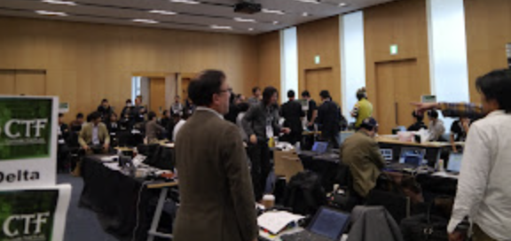</div>
  <div class="text-xs mb-3">SECCON 全国大会 2012年度（初回）</div>
  <div></div>
  <div class="text-xs">Google Hackceler8</div>
</div>

</div>

---

# なぜA&Dなのか

<div class="grid grid-cols-[1.4fr_1fr] gap-8 mt-8 items-center">

- **攻撃・防御・運用をすべて自分たちでこなす**
  - 単に攻撃するだけでなく、**「稼働させながら直す」「攻撃を観測して学ぶ」** 実践力が求められる
  - 攻撃と防御、両方の視点が得られる
- **チームとしての戦略・マネジメント**
  - 「誰が何を直すか」「いつパッチを当てるか」など、リソース配分や役割分担も必要
- **リアルタイムな攻防戦**
  - 単なるパズル解きとは異なり、相手の動きに合わせた臨機応変な対応が求められる

<div class="rounded-lg aspect-video flex flex-col items-center justify-center text-gray-500">
  <div>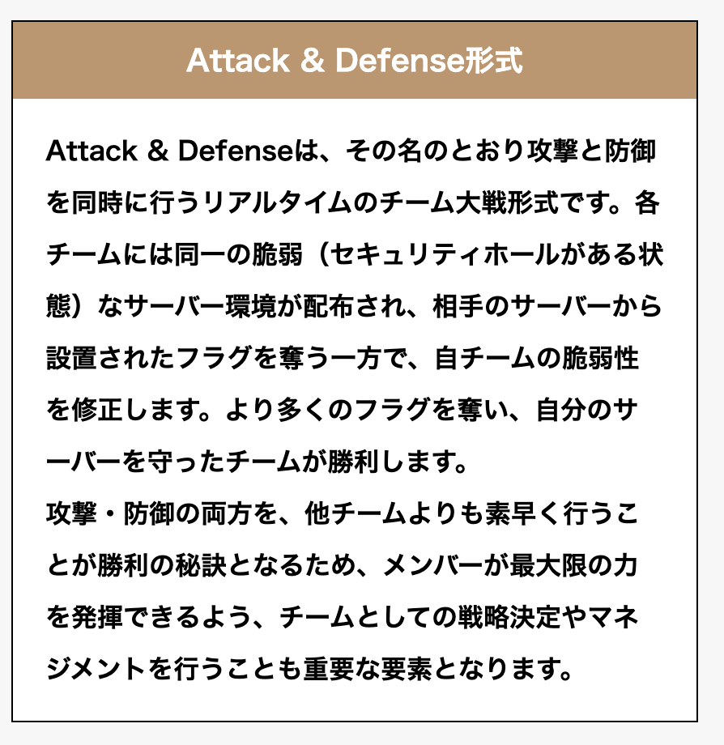</div>
  <div class="text-xs mb-3">出典: <a href="https://icctokyo2025.nisc.go.jp/ctf/">https://icctokyo2025.nisc.go.jp/ctf/</a></div>
</div>

</div>

---

# 世界の代表的な A&D CTF (1)
## DEF CON CTF

<div class="grid grid-cols-[1.2fr_1fr] gap-8 mt-8 items-center">

<div>

- 世界最高峰のセキュリティコンテスト
- ラスベガスで毎年開催される決勝戦は伝統的にA&D形式
- 独自アーキテクチャやエミュレータを題材にしたり、プレイヤーを苦しめる問題が多い
- 世界中のトップチームが一年をかけてここを目指す

</div>

<div class="rounded-lg aspect-video flex flex-col items-center justify-center text-gray-500">
  <div></div>
  <div class="text-xs">出典: <a href="https://gmo-cybersecurity.com/blog/defconctf2019_interview/" target="_blank">https://gmo-cybersecurity.com/blog/defconctf2019_interview/</a></div>
</div>

</div>

---

# 世界の代表的な A&D CTF (2)
## HITCON CTF

<div class="grid grid-cols-[1.2fr_1fr] gap-8 mt-8 items-center">

<div>

- 台湾で開催されるトップレベルのCTF
- Web, Pwn, Cryptoなどバランスの良い出題
- 写真の2023年は、TWN48というアイドルグループとして他のチームよりもチャンネル登録者数やスパチャを集めるというテーマ
  - 当時の蔡英文総統も見に来た

</div>

<div class="rounded-lg aspect-video flex flex-col items-center justify-center text-gray-500">
  <div>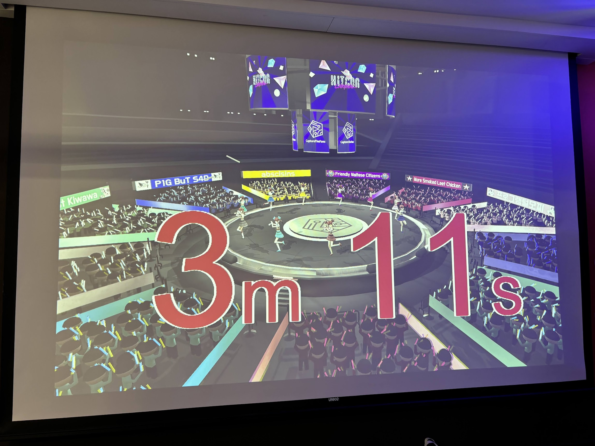</div>
  <div class="text-xs">HITCON CTF 2023</div>
</div>

</div>

---

# ICC (International Cybersecurity Challenge) 

<div class="grid grid-cols-[1.3fr_1fr] gap-8 mt-8 items-center">

<div>

### 25歳以下の若手実力者が集う世界大会

各地域（欧州、アジア、米国など）の予選を勝ち抜いた代表チームによる対抗戦。

<div class="mt-8 p-4 bg-gray-50 dark:bg-gray-800/50 rounded-lg border border-gray-200 dark:border-gray-700">

<div class="font-bold mb-2 flex items-center gap-2 text-lg">
  <span>🇯🇵</span>
  <span>2025年、開催地が日本に</span>
</div>

**ICC Tokyo** として、国家サイバー統括室 (NCO) 主催のもと幕張で開催

- **競技形式**: <span class="text-blue-500 font-bold">Jeopardy</span> と <span class="text-red-500 font-bold">Attack & Defense</span> の2種目
- **参加**: ヨーロッパ、アジアなど世界8地域別チーム

</div>

</div>

<div class="rounded-lg aspect-video flex flex-col items-center justify-center text-gray-500">
  <div>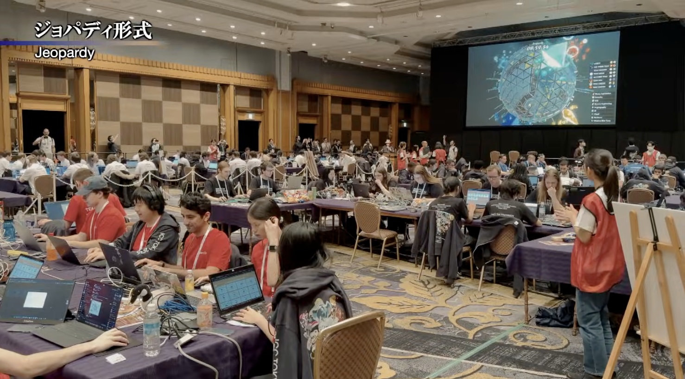</div>
  <div class="text-xs">出典: <a href="https://www.youtube.com/watch?v=qAqhfy9eBUg" target="_blank">https://www.youtube.com/watch?v=qAqhfy9eBUg</a></div>
</div>

</div>

---
layout: center
class: text-center
---

# A&Dのゲーム設計について（ICC版）

---

# ICCにおける Attack & Defense

<div class="grid grid-cols-[1.4fr_1fr] gap-12 mt-8 items-center">

<div>

### <span class="text-red-500">Attack</span> & <span class="text-blue-500">Defense</span>

- 全チームに同じ「脆弱なサーバ環境」が配布され、サーバを運用（防御）しつつ他チームを攻撃し合う
- 勝負のカギ
  - ⚔️ 攻撃: 脆弱性を見つけて攻略する
  - 🛡️ 防御: 攻撃される前に素早く脆弱性を修正する
</div>

<div class="rounded-lg aspect-video flex flex-col items-center justify-center text-gray-500">
  <div class="mb-2">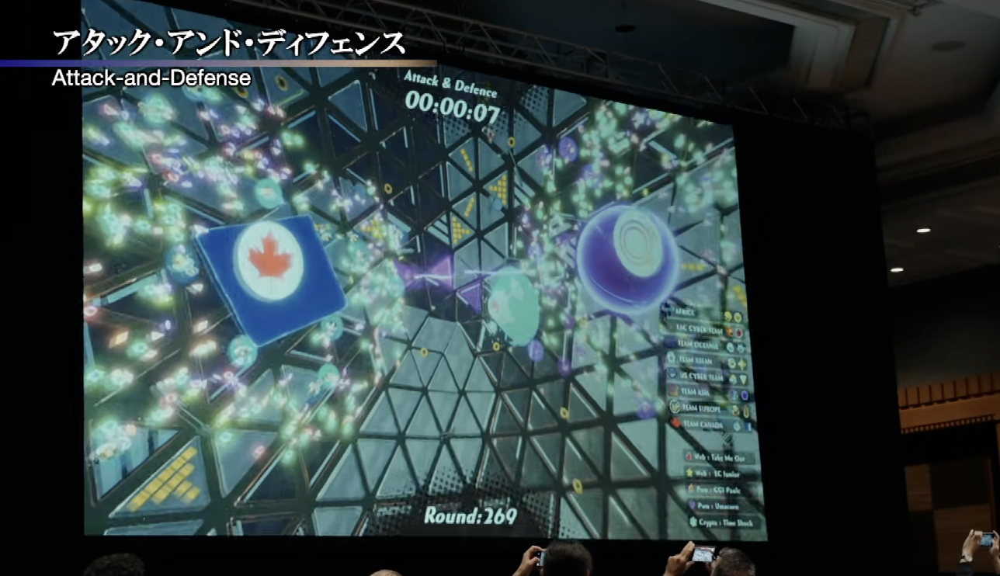</div>
  <div class="text-xs">出典: <a href="https://www.youtube.com/watch?v=qAqhfy9eBUg" target="_blank">https://www.youtube.com/watch?v=qAqhfy9eBUg</a></div>
</div>

</div>

---

# ゲームの進行

競技は **Tick（ラウンド）** 単位で進行

- **2分で 1 Tick 進行**
  - 今回のハンズオンでは 5分で1 Tick進行
- **各Tickで**
  - 全サーバが自動的に再起動される
    - パッチが適用された最新のDockerイメージで起動
  - 新しいFlagが生成される
  - プレイヤーは他のチームに攻撃
  - Botがサーバが正常に起動しているか確認
- これを繰り返す

---

# A&Dのフロー (1): 攻撃

1. **攻撃**: 他チームのサーバを攻撃
2. **Flag奪取**: 脆弱性を突いてFlagを奪取
3. **提出**: スコアサーバーに提出して得点

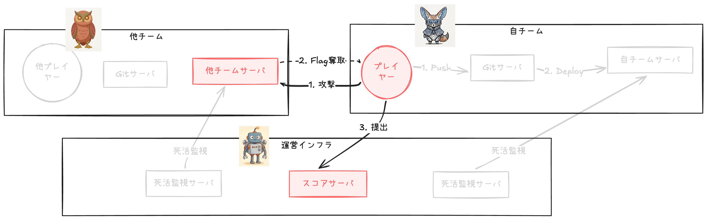

---

# A&Dのフロー (2): パッチ

1. **修正**: 脆弱性を修正したコードをGitリポジトリにPush
2. **反映**: 次のラウンドからサーバにデプロイされる
    - ビルドシステム！

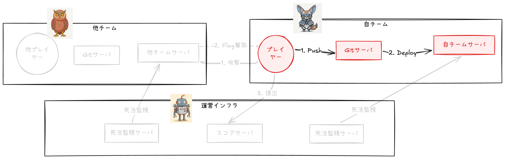

---

# A&Dのフロー (3): SLAチェック

1. **SLAチェック**: Botがサーバを巡回し、正常性をチェック
    - SLA (Service Level Agreement) = サーバが正常に稼働しているかの指標
2. **減点**: サーバが正常に動いていないと判断された場合、SLA減点

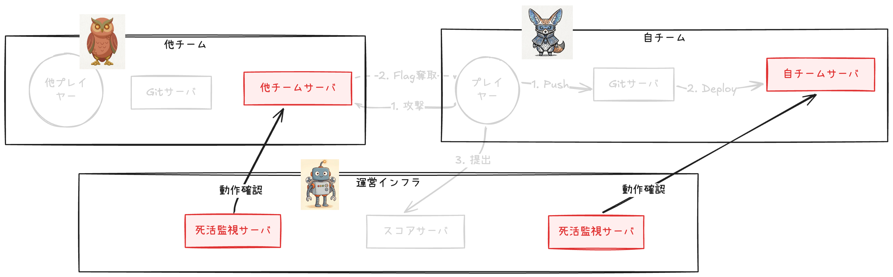

---

# A&Dのフロー (4): ラウンドの進行、再起動

1. **ラウンド進行**: 2分ごとにラウンドを1つ進行、スコアボードを更新
2. **再起動**: 全チームのサーバを再起動、FLAGも新しいものに入れ替え
3. **PCAP**: ネットワーク上のパケットがプレイヤーに提供される


---

# スコアリング

**スコア = SLA + Defense + Attack**

<div class="grid grid-cols-3 gap-4 mt-8">

<div class="p-4 border rounded-lg border-blue-200 bg-blue-50 dark:bg-blue-900/20 dark:border-blue-800">
  <h3 class="text-blue-600 dark:text-blue-400 font-bold mb-2">🟢 SLA (可用性)</h3>
  <div class="text-sm">
    サービスが正常に稼働しているか？
    <br><br>
    Botが正常性をチェック。<br>
    <strong>正常に動作していないと減点。</strong><br>
    パッチで機能を壊さないように注意！
  </div>
</div>

<div class="p-4 border rounded-lg border-green-200 bg-green-50 dark:bg-green-900/20 dark:border-green-800">
  <h3 class="text-green-600 dark:text-green-400 font-bold mb-2">🛡️ Defense</h3>
  <div class="text-sm">
    Flagを守り切れたか？
    <br><br>
    そのTickで、誰にもFlagを盗まれなければ防御成功。<br>
    <strong>1チームでも盗まれると0点。</strong>
  </div>
</div>

<div class="p-4 border rounded-lg border-red-200 bg-red-50 dark:bg-red-900/20 dark:border-red-800">
  <h3 class="text-red-600 dark:text-red-400 font-bold mb-2">⚔️ Attack</h3>
  <div class="text-sm">
    他チームからFlagを奪ったか？
    <br><br>
    防御に失敗したチームの点数がプールされ、<br>
    <strong>成功した攻撃チームで山分け。</strong>
  </div>
</div>

</div>

---
layout: center
class: text-center
---

# 攻撃の視点

---

# 攻撃とFLAG提出

脆弱性を見つけ、他チームを攻撃してFLAGを奪取する

1. 配布されたファイルを読み解く
2. Exploit（攻撃プログラム）を作成して他チームのサーバーに送信
3. FLAGを取得してスコアサーバーに提出

```bash
curl --json '{"flags":["ICC{THIS_IS_A_FLAG}"]}' \
 -H "Authorization: Bearer <TEAM_API_KEY>" \
 http://minicamp.mocos.kitchen/core.v1.FrontendService/SubmitFlags
```

<div class="w-1/2 mx-auto">
  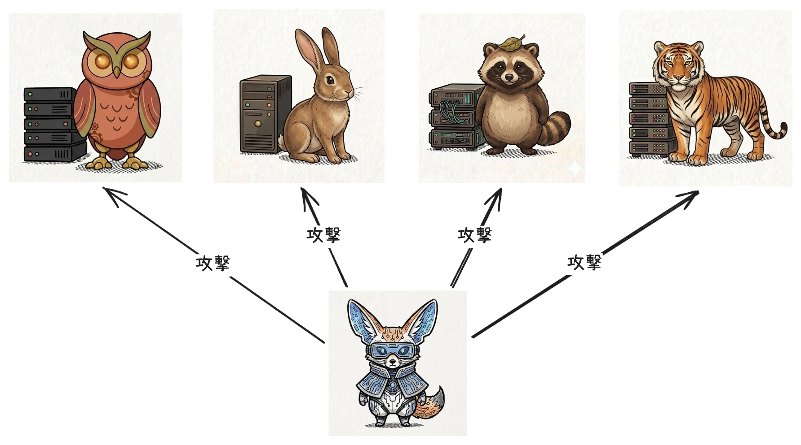
</div>

---
layout: center
class: text-center
---

# 防御の視点

---

# パッチの適用

脆弱性を探し、パッチを適用する

- 配布されたファイルを読み解く
- サービスを壊さないように慎重にパッチ

```bash
git add patchable/filter.py
git commit -m "Fix vulnerability"
git push
```

<div class="w-1/2 mx-auto text-center">
  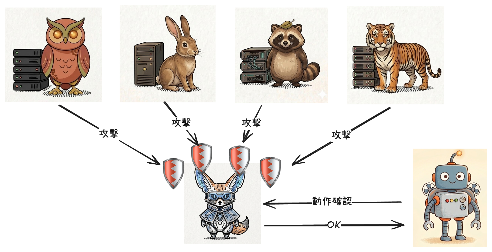
  <span class="text-sm text-gray-500 ">完璧な防御ができた状態</span>
</div>


---

# 攻撃の検知

脆弱性が見つからなかったどうしようにもない？ → NO

- pcapファイル（ネットワーク上の通信の記録）が提供される
    - 敵の攻撃パケットは「答え」でもある
    - 攻撃を分析して反撃の糸口を探る

<div class="w-2/3 mx-auto">
  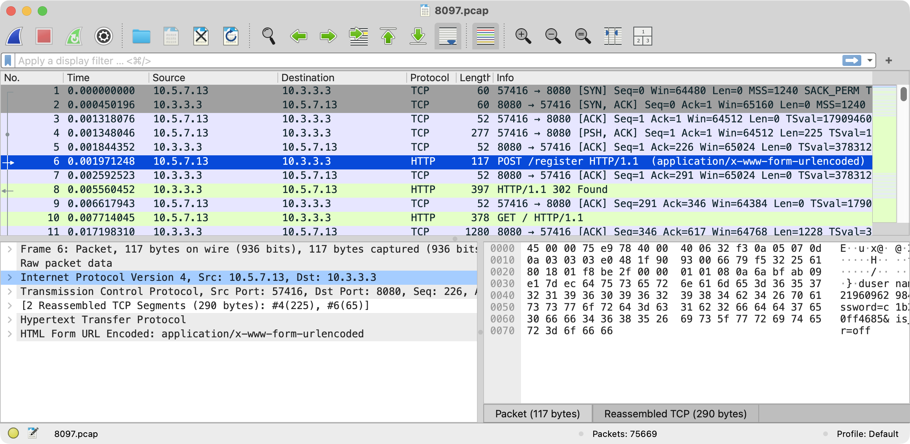
</div>

---
layout: center
class: text-center
---

# A&D環境に触ってみよう


---

# チーム分け

テーブルでチーム分けを行います

| 番号| チーム名  | メンバー |
| --- | --- | --- |
| 1 | アライグマ |  |
| 2 | イヌ |  |
| 3 | ウサギ |  |
| 4 | エビ |  |
| 5 | オオカミ |  |
| 6 | カメ |  |
| 7 | キツネ | 確認用 |

---

# A&D チュートリアル

やることたくさん

1. **ソフトウェアのインストール**: 必要なツールの準備
2. **スコアボードにアクセス**: 問題情報やスコアボードを確認
3. **VPN接続**: WireGuardで競技環境に接続
4. **ネットワーク接続確認**: 問題サーバーやGitサーバーにアクセスできるか確認
5. **ソースコードを取得**: `git clone` で手元に持ってくる
6. **攻撃&FLAG提出**: 脆弱性を突いてFLAGを奪取
7. **パッチ適用**: 脆弱性を修正して守る
8. **パケット観察**: 攻撃の痕跡をネットワーク上で確認

（※ハンズオン環境では、実際の競技環境よりもチート対策やプラットフォームのセキュリティが緩いため、そのあたりはお手柔らかにお願いします🙏）

---

# ステップ1：ソフトウェアのインストール

- WireGuard: https://www.wireguard.com/install/
  - VPNクライアント
- Wireshark: https://www.wireshark.org/
  - パケットキャプチャツール
- Docker: https://www.docker.com/
  - 仮想環境の構築
- git: https://git-scm.com/
  - ソースコード管理

---

# ステップ2：スコアボードにアクセス

kintoneにチームごとのトークンを配布します。スコアボードにアクセスしてみましょう。

- **URL**: `http://minicamp.mocos.kitchen/`
  - **Scoreboard**: 現在の順位と各チームの状態
  - **Challenges**: 各問題のIPアドレスとソースコードのURL
  - **My Team**:
    - **DEPLOYMENTS**: 自分のサーバーの状態
    - **SLA HISTORIES**: SLAの結果
    - **BUILD HISTORIES**: パッチのビルド状況
    - **PCAP**: 攻撃パケットのキャプチャデータダウンロード画面
    - **WIREGUARD CONFIG**: VPN接続の設定ファイルダウンロード画面


---

# ステップ2：スコアボードにアクセス

<div class="grid grid-cols-2 gap-4">
  <div class="text-center">
    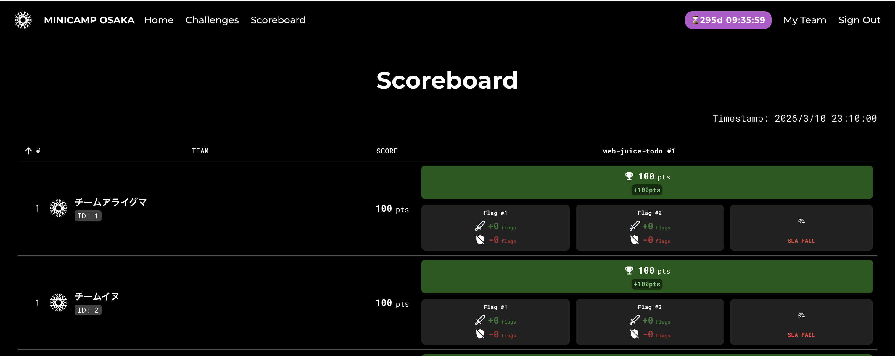
    <p class="text-sm mt-1">スコアボード</p>
  </div>
  <div class="text-center">
    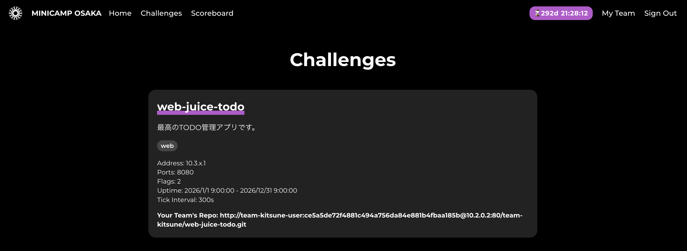
    <p class="text-sm mt-1">問題ページ</p>
  </div>
  <div class="text-center">
    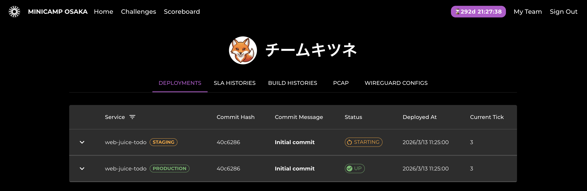
    <p class="text-sm mt-1">デプロイ結果ページ</p>
  </div>
  <div class="text-center">
    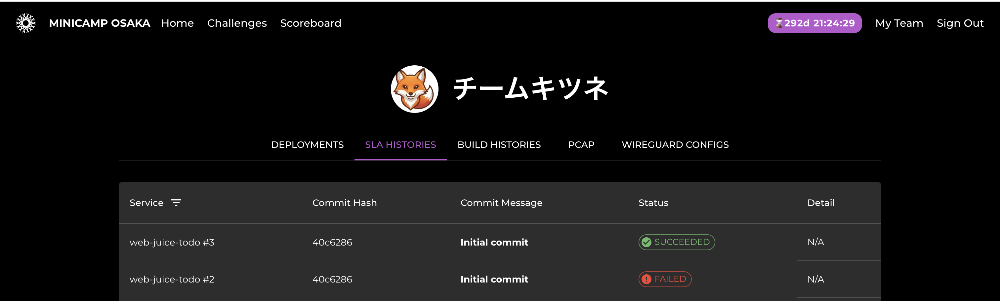
    <p class="text-sm mt-1">SLA結果ページ</p>
  </div>
</div>


---

# ステップ2：スコアボードにアクセス

- スコアボードの読み方

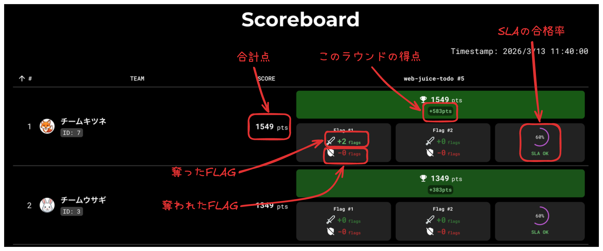

---

# ステップ3：VPN接続

- WIREGUARD CONFIGから設定ファイルをダウンロード

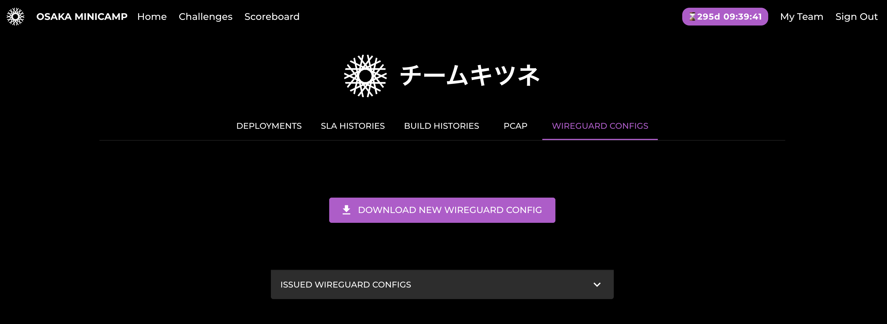

- WireGuardクライアントにインポート→有効にして接続

<div class="flex gap-4 mt-2 justify-center">
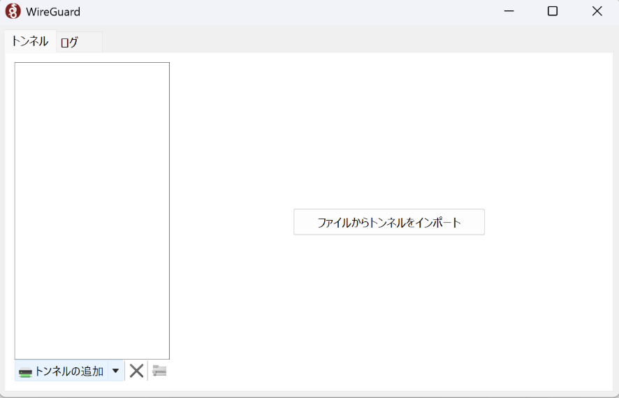
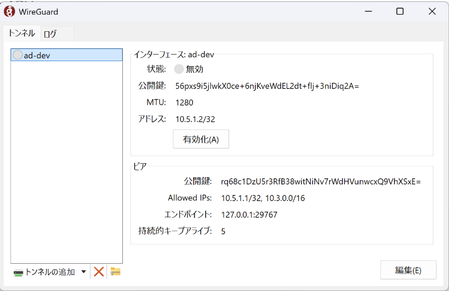
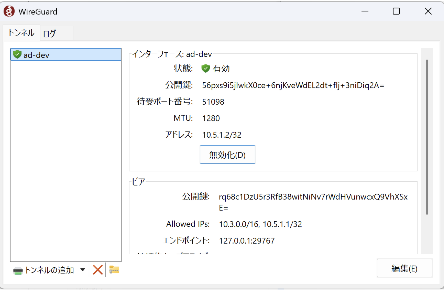
</div>

---

# ステップ4：ネットワーク接続確認

競技ネットワークに接続できたか確認してみましょう

- Challengesページに2つのURLが記載されているはずです
  - 10.3.x.1: 各チームの問題サーバ
    - x = チーム番号（1-7）
  - 10.2.0.2: Gitリポジトリのサーバ
- ブラウザで `http://10.3.7.1/` にアクセスしてみましょう

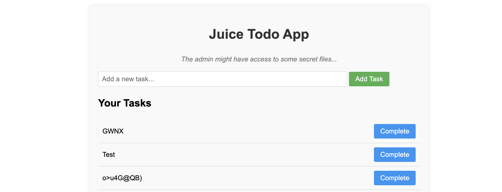

---

# ステップ5：ソースコードを取得

自分の守るべきサービスの「中身」を手に入れます。

- ChallengesページのURLを使って `git clone`
  ```bash
  git clone http://*****:10.2.0.2/team-***/web-juice-todo.git
  cd web-juice-todo
  ```
- **中身を確認**:
  - `patchable/`: 編集できるフォルダ。ここにパッチを当てる
  - `compose.yml`: Docker Composeファイル
  - `Dockerfile`: Dockerイメージ

**patchable/以外のファイルは編集してもpushできないので注意！**

---

# ステップ6：攻撃&FLAGの提出

脆弱性を見つけて攻撃し、FLAGを奪取しましょう

- ソースコードを読んで脆弱性を見つけてみよう
- 典型的なSQLインジェクションが存在します
  - patchable/app.js 63行目あたり

```javascript {7}
app.post('/todos', (req, res) => {
  const { task } = req.body;
  if (!task || task.trim() === '') {
    return res.status(400).send('Task cannot be empty');
  }

  db.run(`INSERT INTO todos (task) VALUES ('${task}')`, function(err) {
```

- ユーザーの入力した `task` がそのまま直接SQL文に埋め込まれている → **SQLインジェクション**

---

# ステップ6：攻撃&FLAGの提出

SQLインジェクションを利用して、FLAGを奪取してみましょう

- 例えば、トップページで `'` を入力してみると、エラーになります
  - SQL文: `INSERT INTO todos (task) VALUES (''')` となり構文エラー

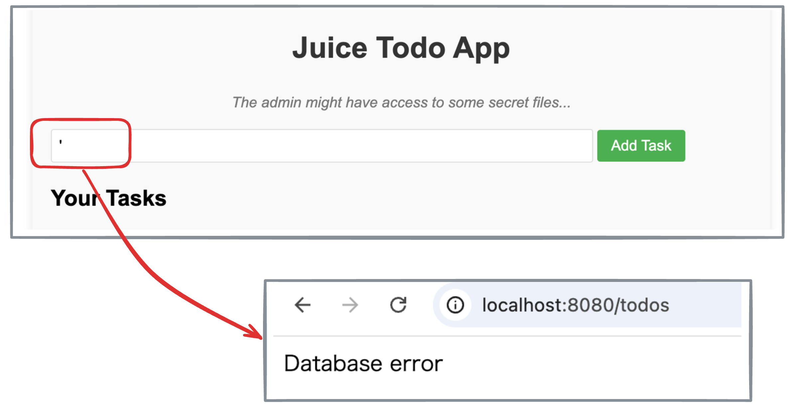

---

# ステップ6：攻撃&FLAGの提出

SQLインジェクションを利用して、FLAGを奪取してみましょう

- `' || (SELECT flag FROM flags) || '` を入力してみると...?

---

# ステップ6：攻撃&FLAGの提出

SQLインジェクションを利用して、FLAGを奪取してみましょう

- `' || (SELECT flag FROM flags) || '` を入力してみると...?

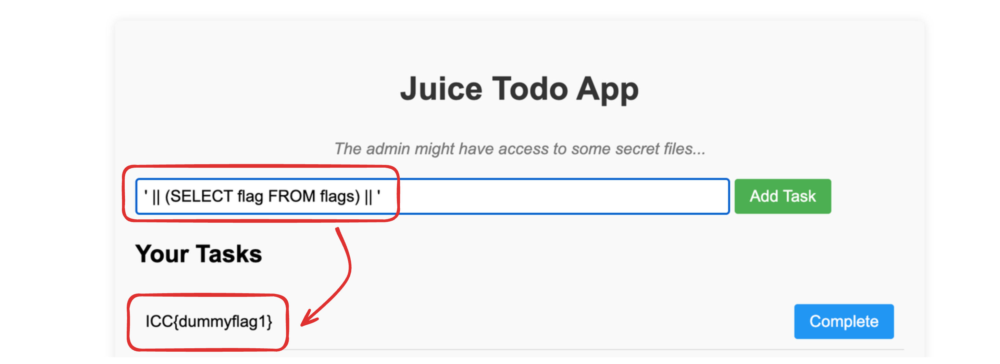

- SQL文: `INSERT INTO todos (task) VALUES ('' || (SELECT flag FROM flags) || '')` となり、`flags` テーブルにあるFLAGが登録される！

---

# ステップ6：攻撃&FLAGの提出

奪ったFLAGをスコアサーバーに送信して、初めて得点になります。

- **提出コマンド**:
  ```bash
  curl --json '{"flags":["ICC{dummyflag1}"]}' \
   -H "Authorization: Bearer <チームトークン>" \
   http://minicamp.mocos.kitchen/core.v1.FrontendService/SubmitFlags
  ```
- **注意点**:
  - FLAGには有効期限（15分）があります。取ったらすぐ出しましょう！
  - 重複提出や自チームFLAG提出はエラーになりますが、ペナルティはないので気軽に提出してください

---

# ステップ7：パッチを当てる

自分のサーバーが攻撃されている、あるいは脆弱性に気づいたら修正します。

- **修正と反映**:
  1. `patchable/` 内のファイルを修正
    ```javascript
  db.run(`INSERT INTO todos (task) VALUES ('${task}')`, function(err) {
    ↓
    ???
    ```
  2. `git commit` & `push`
  3. ビルドシステムが動き、**次以降のTick**で反映される

---

# ステップ7：パッチを当てる

パッチ時の注意点

- **patchable/以外は編集できない**:
  - `compose.yml` や `Dockerfile` は編集してもpushできません
- **SLAに注意**:
  - サービスが正常に動作していないと判断されると、SLA減点になります
  - 出力をいじる、機能を削除すると減点になりやすいので注意
- **ビルドの失敗に注意**:
  - パッチをpushした後、ビルドが失敗すると反映されません
  - 変更をたくさん加えた場合は、`docker compose up`で動作確認するのがおすすめです
- **gitのconflictに注意**:
  - 他のチームメンバーも同じファイルを修正していると、コミットが衝突することがあります
  - 頑張って解決してください💪

---

# ステップ7：パッチを当てる

- ビルドが通ると、BUILD HISTORIESに成功のログが出ます

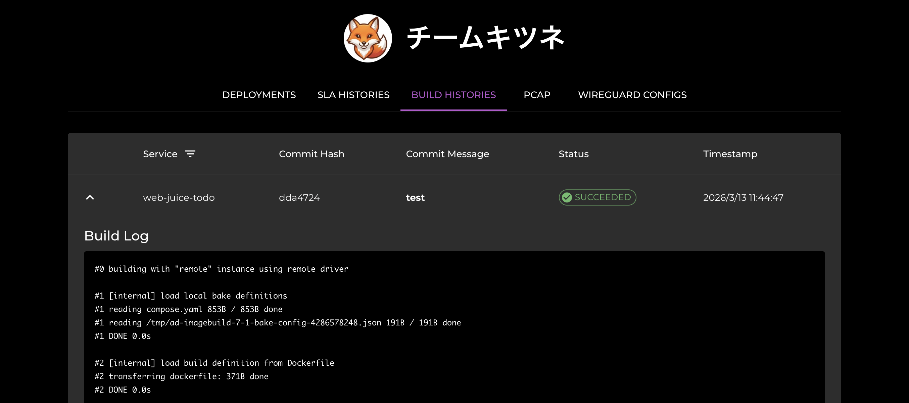

---

# ステップ8：パケットを観察する

攻撃の痕跡は、ネットワーク上に残ります。パケットキャプチャを見てみましょう。

- `.pcapng` ファイルは5分ごとに、5分前までのデータが提供されます
- スコアボードの「My Team」→「PCAP」からダウンロードして、Wiresharkで開いてみましょう
  - 自分のチームのサーバに送信されたパケットだけが入っています
  - ファイルの中身が空っぽだった人は、「キツネチーム」にログインしてダウンロードしてみてください

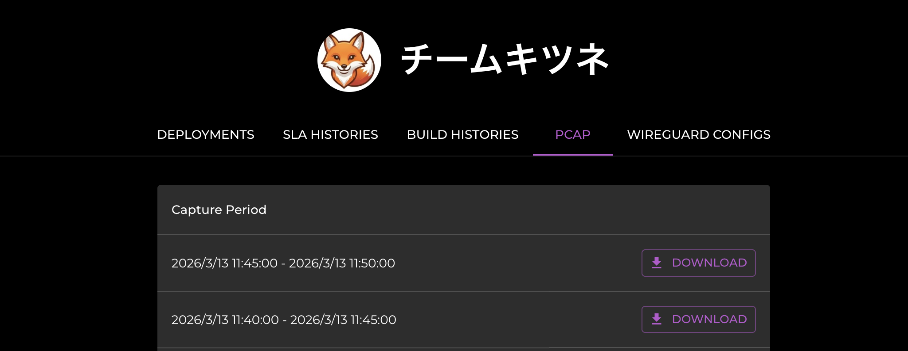

---

# ステップ8：パケットを観察する

- Protocolの列がHTTPになっているパケットを探してみましょう
- 右クリックして「Follow」→「HTTP Stream」を選択すると、その通信の内容が見られます

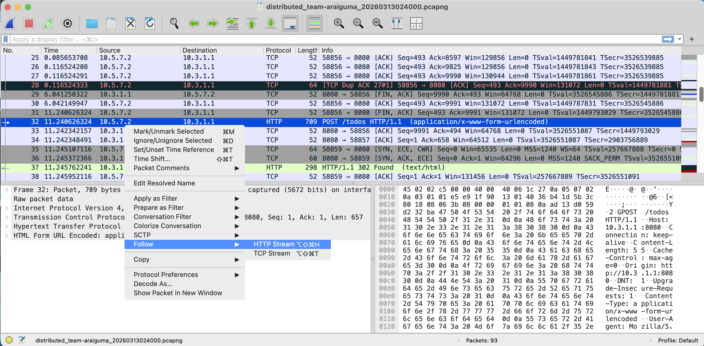

---

# ステップ8：パケットを観察する

- ↓ では `' || (SELECT flag FROM flags) || '` がURLエンコードされて送られていることが分かる

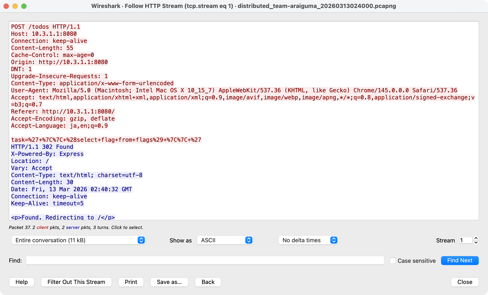

---

# ステップ8：パケットを観察する

- Wiresharkのフィルタを使って、`ICC{`を含むパケットだけを表示してみましょう
- フィルタの入力欄に `http contains "ICC{"` と入力

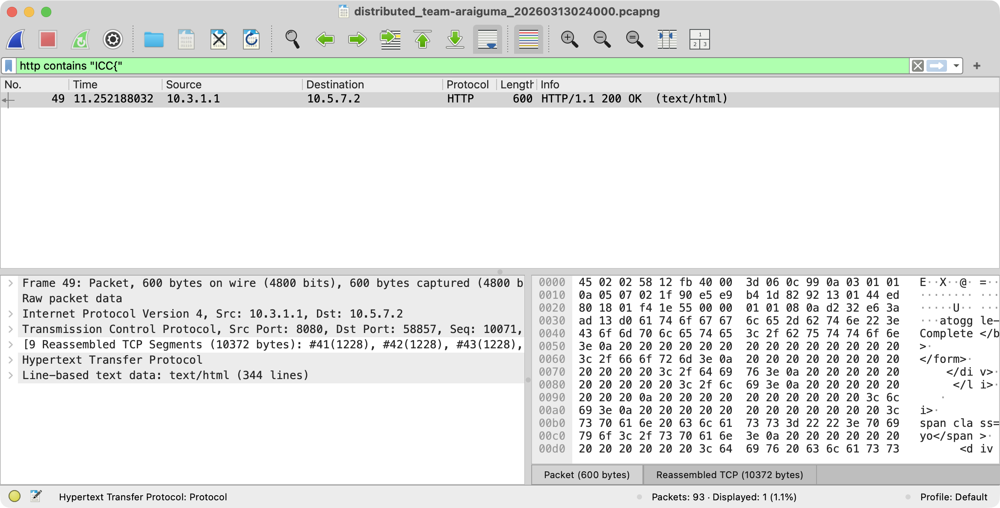

---
layout: center
class: text-center
---

# 〜ちょっと休憩〜

15:00 からゲーム開始です！

---

# A&D スタート!

- 期間: 15:00 ~ 15:50
- 1ラウンド5分、10ラウンド
- チャレンジ: Webアプリケーション「Juice Todo」
  - 脆弱性がいくつかあります
  - **FLAGが2つ**あるので、両方submitするのを忘れずに！
  - 脆弱性自体は比較的簡単ですが、Webアプリケーションに慣れていないとちょっと大変かも
    - チームで相談しながら進めてください
  - SLAの基本ルール: **どんな出力も変更してはいけません**

---
layout: center
class: text-center
---

# 〜ハンズオン終了〜

---

# 結果発表

- 優勝: チーム〇〇
- 2位: チーム△△
- 3位: チーム□□

---

# 振り返り

- どんな攻撃をしましたか？
- どんなパッチを当てましたか？
- PCAPからどんなことがわかりましたか？
- SLAにイライラしましたか？
- どんな戦略を立てましたか？
- どんな失敗があったか？

---

# 高度な攻防 (1): 情報の非対称性

攻撃することは、脆弱性の場所を教えること

- 攻撃パケットは防御側のログに残る
- 上位チームの攻撃は、下位チームにとって「最高のお手本」となる
- 攻撃者は、他のチームに検知されないよう慎重に攻撃する必要がある
- 攻撃するほど、自分の手の内が相手に見える→「諸刃の剣」

---

# 高度な攻防 (2): 攻撃の再利用 (Replay Attack)

原理がわからなくても、攻撃はできる

- 来たパケットをそのまま投げ返す
- 脆弱性の詳細を知らなくても得点できてしまう
- 会場全体に同じ攻撃が蔓延する（Replay Storm）

---

# 高度な攻防 (3): 解析を拒む技術

攻撃を隠し、解析を遅らせる

- 通信を暗号化し、盗聴・ReplayされてもFLAGを守る
- 偽の攻撃を大量に混ぜ、どれが本命か分からなくする
- 終了間際まで攻撃を隠し持ち、パッチの時間を与えない

ICCでもパケットがcaronteで表示されないようにしたチームがいた

過去のDEF CONではWiresharkをクラッシュさせる0-dayを使ったチームも

---

# ネットワーク解析ツール

A&D向けのトラフィック分析ツールが色々あります

<div class="flex flex-col gap-4 mt-6">
<div class="border border-gray-200 rounded-lg p-4 shadow-sm">
<strong>caronte</strong><br>
<span class="text-sm opacity-60">https://github.com/eciavatta/caronte</span><br>
フローの分類・ルールベースの攻撃検出
</div>
<div class="border border-gray-200 rounded-lg p-4 shadow-sm">
<strong>tulip</strong><br>
<span class="text-sm opacity-60">https://github.com/OpenAttackDefenseTools/tulip</span><br>
攻撃スクリプトの自動生成・Suricata連携
</div>
<div class="border border-gray-200 rounded-lg p-4 shadow-sm">
<strong>pkappa2</strong><br>
<span class="text-sm opacity-60">https://github.com/spq/pkappa2</span><br>
高速なPCAP閲覧・タグ管理
</div>
</div>

---

# ネットワーク解析ツール: caronte


---

# Player vs Organizer

- 今回の環境ではSLAのパケットとほかチームのパケットをIPアドレスやTTL、RTTで区別できたかも
  - 実際の競技環境では区別がつかないようにNATしたり間にプロキシを挟んだりする
  - https://github.com/ctfplatform/simple-network-proxy

---

# Player vs Organizer

> 「A&D は本質的に壊れていて、終わっている」

<div class="mt-4 text-xs opacity-60 break-all">
  Reference: <a href="https://github.com/hugeh0ge/substitute-of-blog/blob/main/blog/2026-01-01-how-to-create-ad-ctf-problems_ja.md" target="_blank">https://github.com/hugeh0ge/substitute-of-blog/blob/main/blog/2026-01-01-how-to-create-ad-ctf-problems_ja.md</a>
</div>

### 良い問題を作るのは難しい

- 理想：脆弱性を見つけ、修正し、攻撃する
- 現実：「反射神経ゲー」になりがち。修正が簡単すぎると差がつかない。難しすぎると誰も直せない。

### それでもA&Dをやる理由

- この「カオス」こそが現実のインシデント対応に近い
- 理不尽な状況下での意思決定、リスク管理
- 何より、燃える（楽しい）

---

# 過去のA&D問題例


---

# 資料

- ICC A&D Platform 解説動画: https://www.youtube.com/watch?v=McQ83ltusCU
- ICC A&D Platform ドキュメント: https://docs.google.com/document/d/1JqkriOo7p_zNRk87gA2VQNmRJoDTgTu2zDSLQSUS7uU/edit?usp=sharing
